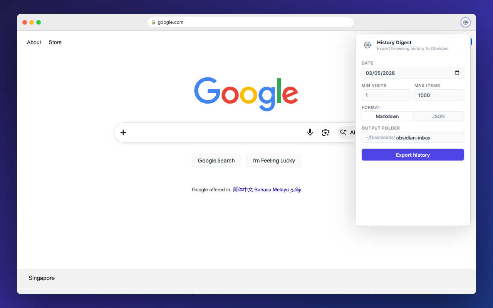

# History Digest

A Chrome extension that exports your daily browsing history as a clean Markdown or JSON digest — perfect for Obsidian, Logseq, or any note-taking system.



## What it does

One click turns a day's worth of browser tabs into a structured, noise-free file:

- **Deduplicates URLs** — normalized URLs are merged, visit counts accumulated
- **Strips tracking parameters** — `utm_*`, `fbclid`, `gclid`, and more
- **Filters noise** — Gmail, Google Drive, Google Calendar, ChatGPT, Spotify, search engines
- **Separates YouTube videos** into their own section
- **Export as Markdown** (YAML frontmatter + checkbox items) or **JSON**
- **100% local** — no servers, no cloud, no data ever leaves your device

## Installation

Install from the [Chrome Web Store](https://chromewebstore.google.com) or load unpacked:

1. Clone this repo
2. Go to `chrome://extensions/`
3. Enable **Developer mode**
4. Click **Load unpacked** → select this folder

## Usage

Click the extension icon on any tab, choose your date and options, then hit **Export history**. The file is saved to `~/Downloads/<folder>/browsing-YYYY-MM-DD.md` (or `.json`).

| Option | Default | Description |
|---|---|---|
| Date | Today | Which day to export |
| Min visits | 1 | Skip URLs visited fewer times than this |
| Max items | 1000 | Cap on number of entries |
| Format | Markdown | `md` or `json` |
| Output folder | `obsidian-inbox` | Subfolder under `~/Downloads/` |

## Obsidian integration

The Markdown output uses YAML frontmatter and checkbox list items that integrate with Obsidian's Tasks and Dataview plugins. Point the output folder at your vault's inbox and process entries during your daily review.

```markdown
---
date: 2026-05-03
type: browsing-digest
count: 42
---

# Browsing — 2026-05-03

- [ ] [Some Article](https://example.com) — 3 visits, typed
- [ ] [Another Page](https://example.com/page)

## Videos

- [ ] [Some Video](https://youtube.com/watch?v=...)
```

## Permissions

| Permission | Why |
|---|---|
| `history` | Read browsing history for the selected date |
| `downloads` | Write the exported file to your Downloads folder |
| `storage` | Save your folder and format preferences locally |

## Privacy

All processing happens on your device. No data is transmitted anywhere. See [privacy policy](privacy.html).

## Development

```bash
npm install
npx playwright install chromium

# Generate store screenshot
npm run screenshot
```
